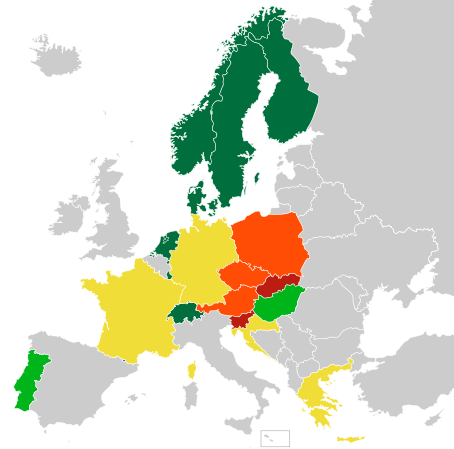

# National railway operator GTFS feeds

This is a map of [GTFS](https://developers.google.com/transit/gtfs/) coverage and availability for national railway operators.

-  Feed including (almost) all long-distance and regional trains, **provided as-is by the operator / an official entity**
-  Feed including (almost) all long-distance and regional trains, **inofficial, not provided by the operator**
-  Nation-wide, incomplete feed, e.g. only long-distance or only regional, either official or inofficial
-  Non-nation-wide feed(s), only partial/regional coverage, either official or inofficial
-  No feeds available
-  Unknown

The original map can be found [here](https://commons.wikimedia.org/wiki/File:Blank_map_of_Europe_EU27_iso3166-1_code.svg).

## Contributing

If you want to add another operator, endpoint or module (even in other programming languages) to this list, feel free to send a pull request or leave us a hint at [the issues page](https://github.com/public-transport/european-transport-operators/issues).
